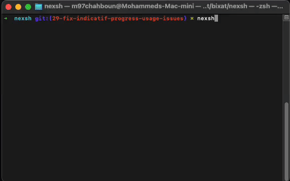

<div align="center">
<a href="https://ummaty.org/gaza"></img></a>

# NexSh 🤖

[](https://crates.io/crates/nexsh)
[](https://opensource.org/licenses/MIT)
[](https://github.com/M97Chahboun/nexsh/actions/workflows/rust.yml)
[](https://m97chahboun.github.io/nexsh)

Next-generation AI-powered shell using Google Gemini

[Installation](#installation) •
[Features](#features) •
[Usage](#usage) •
[Configuration](#configuration) •
[Contributing](#contributing) •
[Documentation](https://m97chahboun.github.io/nexsh)



</div>

> ⚠️ **Note**: This project is under active development. Features and Commands may change.


## 🌟 Features

- 🧠 **AI-powered command interpretation** - Understands natural language commands
- 🔄 **Smart conversion** - Translates your words into precise shell commands
- 🎨 **Interactive experience** - Colorful output with intuitive formatting
- 📝 **Enhanced history** - Search and recall past commands easily
- 🛡️ **Safety first** - Warns before executing potentially dangerous commands
- 🚀 **Multiple modes** - Interactive shell or single-command execution
- 💻 **Cross-platform** - Works on Linux, macOS, and Windows

## 🚀 Installation

### From GitHub Releases (Recommended)

You can download pre-built binaries for your platform from our [GitHub Releases](https://github.com/M97Chahboun/nexsh/releases) page.

1. Visit the [Releases](https://github.com/M97Chahboun/nexsh/releases) page
2. Download the appropriate file for your platform:
   - Windows: `nexsh-windows.zip`
   - macOS: `nexsh-macos.tar.gz`
   - Linux: `nexsh-linux.tar.gz`
3. Verify the download using SHA256 checksum:
   ```bash
   # Download both the binary and its checksum
   curl -LO https://github.com/M97Chahboun/nexsh/releases/latest/download/nexsh-linux.tar.gz
   curl -LO https://github.com/M97Chahboun/nexsh/releases/latest/download/nexsh-linux.sha256
   
   # Verify the checksum (Linux/macOS)
   echo "$(cat nexsh-linux.sha256)  nexsh-linux.tar.gz" | shasum -a 256 --check
   ```
4. Extract the archive:
   ```bash
   # For Linux/macOS
   tar xzf nexsh-linux.tar.gz
   
   # For Windows
   unzip nexsh-windows.zip
   ```
5. Move the binary to a directory in your PATH:
   ```bash
   # Linux/macOS
   sudo mv nexsh /usr/local/bin/
   
   # Windows: Move nexsh.exe to a directory in your PATH
   ```
   
### Using Cargo

```bash
cargo install nexsh
```

### From Source

```bash
# Clone the repository
git clone https://github.com/M97Chahboun/nexsh.git
cd nexsh

# Build and install
cargo build --release
sudo cp target/release/nexsh /usr/local/bin/
```

### Platform-Specific Packages

#### macOS (Homebrew)

```bash
brew tap M97Chahboun/nexsh
brew install nexsh
```

#### Arch Linux (AUR)

```bash
yay -S nexsh
```

## 🛠️ Setup

First-time configuration:

You'll need to:
1. Enter your Gemini API key when prompted
2. Get your API key from [Google AI Studio](https://aistudio.google.com/)
3. The key will be securely stored in your system's config directory

## 📚 Usage

### Interactive Shell Mode

```bash
nexsh
```

Example session:

```bash
$ nexsh
🤖 Welcome to NexSh! Type 'exit' to quit or 'help' for assistance.

nexsh> show me system memory usage
→ free -h
              total        used        free      shared  buff/cache   available
Mem:           15Gi       4.3Gi       6.2Gi       386Mi       4.9Gi        10Gi
Swap:         8.0Gi          0B       8.0Gi

nexsh> find files modified in the last 24 hours
→ find . -type f -mtime -1
./src/main.rs
./Cargo.toml
./README.md
```

### Single Command Mode

```bash
nexsh -e "show all running docker containers"
```

### Key Commands

| Command       | Action                          |
|---------------|---------------------------------|
| `exit`/`quit` | Exit the shell                  |
| `help`        | Show available commands        |
| `Ctrl+C`      | Cancel current operation        |
| `Ctrl+D`      | Exit the shell                  |
| `Up/Down`     | Navigate command history        |

## ⚙️ Configuration

Configuration files are stored in platform-specific locations:

- **Linux**: `~/.config/nexsh/`
- **macOS**: `~/Library/Application Support/nexsh/`
- **Windows**: `%APPDATA%\nexsh\`

### Configuration Options

Edit `config.json` to customize settings:

```json
{
   "api_key": "your_gemini_api_key",
   "history_size": 1000,
   "max_context_messages": 10
}
```

| Setting | Description | Default |
|---------|-------------|---------|
| `api_key` | Your Gemini API key | Required |
| `history_size` | Number of commands to keep in history | 1000 |
| `max_context_messages` | Maximum messages to keep in AI context | 10 |
```

## 🤝 Contributing

We welcome contributions! Here's how to get started:

1. Fork the repository
2. Create your feature branch (`git checkout -b feature/amazing-feature`)
3. Commit your changes (`git commit -m 'Add some amazing feature'`)
4. Push to the branch (`git push origin feature/amazing-feature`)
5. Open a Pull Request

Please read our [Contribution Guidelines](CONTRIBUTING.md) for more details.

## 📝 License

MIT License - See [LICENSE](LICENSE) for full details.

## 🙏 Acknowledgments

- Google Gemini for powering the AI capabilities
- The Rust community for amazing crates and tools
- All contributors who helped shape this project

## 📱 Connect

- **Author**: [M97Chahboun](https://github.com/M97Chahboun)
- **Report issues**: [Issue Tracker](https://github.com/M97Chahboun/nexsh/issues)
- **Follow updates**: [Twitter](https://twitter.com/M97Chahboun)

<div align="center">
Made with ❤️ by <a href="https://github.com/M97Chahboun">M97Chahboun</a>
</div>
